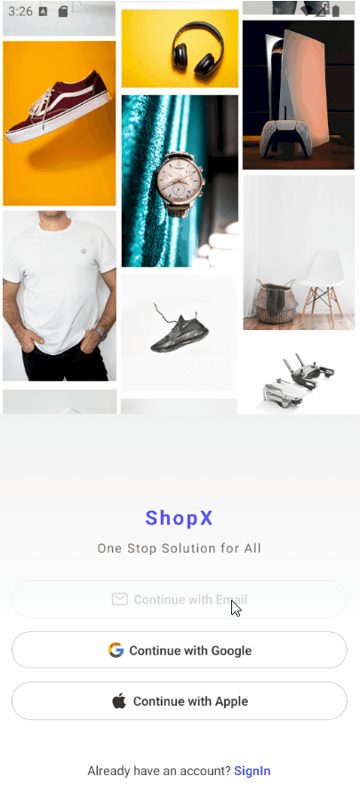
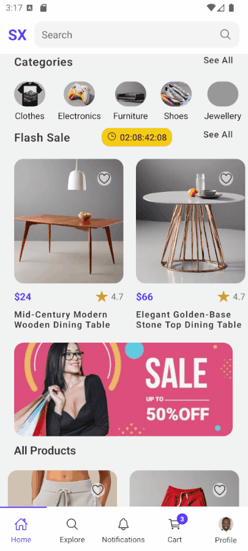

<p align="center">
  
</p>

<h1 align="center">🧺 XShop</h1>

<p align="center">
  Мобильное приложение для покупок хозяйственных и бытовых товаров.<br />
  Удобная навигация по категориям, избранное, корзина и оформление заказов.
</p>

---

## 📱 Превью 

Приложение в действии: быстрый просмотр товаров, плавная анимация и удобная навигация.  
Ниже — три ключевых сценария использования.

<p align="center">
  
  &nbsp;
  
  &nbsp;
  
</p>

<p align="center">
  <em>Слева: окно авторизации | Центр: главная страница | Справа: остальные страницы</em>
</p>

---
## ⚙️ Стек технологий

- ⚛ **React Native** — кроссплатформенная разработка под iOS и Android
- 🚀 **Expo** — простая и быстрая сборка/отладка
- 🔡 **TypeScript** — надёжная типизация и автодополнение
- 🗂️ **json-server** — локальный REST API для хранения данных (товары, категории, пользователь)

---
## 🔗 Как открыть приложение XShop в Expo Go

Приложение можно запустить на телефоне через QR-код с помощью Expo Go.

### 🔷 Шаги:

1. 📲 Установи [Expo Go](https://expo.dev/client) из App Store или Google Play  
2. 🔐 Открой Expo Go и войди в свой аккаунт (если требуется)  
3. 📷 Отсканируй QR-код ниже с помощью камеры или прямо в приложении Expo Go  
4. 🚀 Приложение автоматически загрузится на твоё устройство

<p align="center">
  
</p>

▶️ Или открой по ссылке в браузере:  
[https://expo.dev/preview/update?message=XShop&updateRuntimeVersion=1.0.0&createdAt=2025-06-01T15%3A53%3A43.254Z&slug=exp&projectId=3f662e17-104b-42ce-a969-f3a457668b5e&group=c4cd6168-ec4d-45ab-86f9-cfe301741f4e]

---

### 1. 📥 Склонируй репозиторий

```bash
git clone https://github.com/pvntheraxxx/XShop.git
cd XShop
```

### 2. 📥 Установи зависимости

```
npm install
```

### 3. 🔌 Запусти локальный сервер данных (json-server)

```
npm install -g json-server
json-server --watch db.json --port 3001
```
⚠️ Убедись, что в коде указан правильный IP-адрес твоего компьютера (например, http://192.168.0.103:3001), особенно если запускаешь на физическом устройстве.
localhost не сработает на телефоне!

### 4. 🚀 Запусти проект

```
npx expo start
```
📱 Отсканируй QR-код через Expo Go
или запусти эмулятор Android через Android Studio

✅ Готово! Приложение работает локально и готово к разработке.
